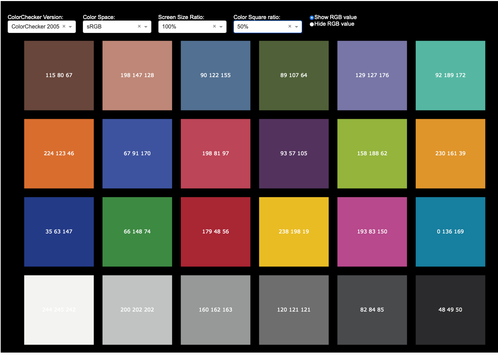

# ColorChecker-App

An interactive Dash + Plotly web application for visualizing ColorChecker charts from an Excel-based dataset.



## ✨ Features

- **Select ColorChecker Version:** Switch between different chart versions.
- **Choose Color Space:** View RGB values in various color spaces.
- **Adjust Screen Size Ratio:** Scale the figure relative to your monitor size.
- **Adjust Color Square Size:** Control the size of each color patch.
- **Toggle RGB Labels:** Show or hide RGB value labels at the center of each color patch.
- **Responsive Layout:** Dynamically adjusts figure size based on screen resolution.

## 📂 Project Structure

```plaintext
ColorChecker-App/
├── colorchecker_app.py               # Main Dash app
├── ColorChecker_RGB_and_spectra.xlsx # Excel file with RGB and spectral data
├── requirements.txt                  # Python dependencies
└── README.md                         # Project documentation (this file)
```

## ✅ Installation

To get started with the Color Checker App, follow these steps:

1.  **Clone the repository:**

    ```bash
    git clone [https://github.com/yourusername/ColorChecker-App.git](https://github.com/yourusername/ColorChecker-App.git)
    cd ColorChecker-App
    ```

2.  **Create and activate a virtual environment (optional but recommended):**

    - Create the virtual environment:
      ```bash
      python -m venv venv
      ```
    - Activate the environment:
      - **Windows:**
        ```bash
        venv\Scripts\activate
        ```
      - **Mac/Linux:**
        ```bash
        source venv/bin/activate
        ```

3.  **Install Python dependencies:**
    ```bash
    pip install -r requirements.txt
    ```

## 📋 Dependencies

The main packages used in this application are:

- **Dash:** Web app framework
- **Plotly:** For interactive plotting
- **Pandas:** For Excel file handling
- **Numpy:** For array manipulation
- **openpyxl:** Excel file reader for Pandas
- **screeninfo:** For detecting monitor resolution

If you need to regenerate the `requirements.txt` file, you can do so by running:

```bash
pip freeze > requirements.txt
```

## 🚀 Running the App

Once you have installed the dependencies, you can run the application using the following command:

```bash
python colorchecker_app.py
```

# ⚠️ Notes

- The Excel file (`ColorChecker_RGB_and_spectra.xlsx`) must remain in the project folder, or you will need to modify the file path in the Python code.
- The Excel file can be downloaded from https://babelcolor.com/colorchecker-2.htm#CCP2_data
- This app uses your local monitor resolution (via the `screeninfo` module) to scale figure size.
- If you plan to deploy online (e.g., Heroku, Render), you will need to adjust the screen size logic to avoid local display dependency.
